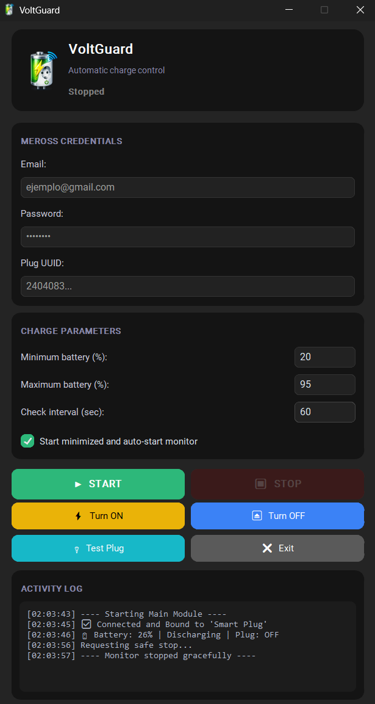

<div align="center">

# VoltGuard 🔋🔌



</div>

Una aplicación nativa de Windows residente, asíncrona y modular diseñada para **monitorizar la batería de un portátil**, y encender/apagar de forma automatizada un enchufe inteligente de la marca **Meross** basado en umbrales de energía configurables. Creada desde cero priorizando la estabilidad, la conexión local persistente y el bajo consumo de recursos (Daemon).

## 🚀 Características Principales

*   **Arquitectura MVC y Asincronía:** El núcleo (Backend) gestiona peticiones asíncronas de lectura (`meross-iot` y `psutil`) totalmente desacopladas de la interfaz visual (`customtkinter`).
*   **Modo Residente (System Tray):** La aplicación está pensada para ejecutarse en segundo plano (Daemon). Al presionar el botón de cierre, se oculta silenciosamente junto al reloj de Windows (`pystray`) y continúa operando de forma desatendida.
*   **Bóveda Criptográfica:** Uso del administrador de credenciales nativo de Windows (Módulo `keyring`). La contraseña real de tu cuenta Meross ¡no se guarda jamás en los ficheros locales!, protegiendo y aislando tus credenciales de los ataques en fichero plano.
*   **Resiliencia Extrema y Antispam:** Si hay un corte Wifi, la app suspende ejecución suavemente y cuenta con una función rotativa matemática para evitar saturar el disco duro en picos falsos.
*   **Agnóstica por Ficheros Absolutos:** Conserva su propio contexto fijo de guardado en la carpeta reservada del sistema para evitar que choquen los ejecutables encapsulados. Todo vive tranquilamente en tu sistema local bajo una estructura unificada y protegida nativamente por Windows.

---

## 💻 Requisitos 

Para poner a funcionar esto sin ejecutar un `.exe` precompilado asegúrate de tener las librerías activas en el entorno (Si usas un requirements.txt virtualizado):

```bash
pip install meross-iot psutil customtkinter pystray keyring pillow python-dotenv
```

> **Aviso de SO:** La lógica de telemetría de energía está compilada en exclusiva tirando del motor `psutil.sensors_battery()`. 

---

## 📂 Arquitectura de Ficheros 

Este proyecto aplica separación de responsabilidades para favorecer mantenimiento:

```text
📁 Proyecto Origen
├── 📄 main.py (Punto de anclaje inicial de la aplicación)
│
└── 📁 src\
    ├── 📄 __init__.py 
    ├── 📄 logger_config.py (Sistema de volcado atómico a Disco utf-8)
    ├── 📄 config_manager.py (Gestor de Modelo y validación del Vault Keyring)
    ├── 📄 battery_backend.py (Back-end en thread y lógica de Meross)
    └── 📄 ui_app.py (Frontend en bloque CustomTkinter y callbacks asíncronos)
```

### Rutas Persistentes
Salvo modificación, el núcleo estático del programa siempre descansará en:
> `C:\Users\TU_USUARIO\AppData\Roaming\VoltGuard`

- `config.json`: Almacena exclusivamente el Email, el UUID del enchufe y los umbrales estadísticos de checkeo asintótico en tiempo plano.
- `voltguard.log`: Registro acotado con auto-borrado (Rotación de fichero a ~1MB de peso máximo con 3 slots temporales en disco) para debug a fondo si falla la UI visual normal del Front.

---

## 🛠 Instalación y Uso 

1. Sitúate en la raíz del proyecto.
2. Abre una terminal.
3. Arráncalo:

```bash
python main.py
```

4. La interfaz visual te pedirá de primera entrada: **Tu correo, Contraseña y el famoso UUID del Enchufe**. Relleno eso, configura los campos de rango `% de Min Batería`, `% Max Batería`, los `Segundos` que el motor espera antes de testear la variable de nuevo. 

### ¿Dónde averiguo mi UUID de Meross?
Toda central Meross en IoT asocia este identificante de forma unívoca de Hardware y Nube. La manera rústica de encontrarlo es usando uno de los test puros asíncronos en forma de script, pero te bastará arrancar la aplicación y ver el log ciego superior.
*El propio log registrará al vuelo y destripará por nosotros cada ID única por cada enchufe de internet a casa si en la consola falla.*

### Botones Activos Especiales:

- **🔌 Test Enchufe**: Herramienta de oro puro. Pulsa esto y tu Frontend pondrá a prueba la asincronía directa con el Backend: tu enchufe intentará encenderse durante _2 segundos enteros_, y se apagará como un chasquido. De esto sacarás dos lecturas: la respuesta de latencia de red, y saber si has acertado escribiendo el UUID.
- **Opción de Iniciar Minimizada**: Perfecto para meter esta aplicación dentro de las opciones de "*Ejecutar al encender el sistema Windows*" de tu propia bandeja de rutinas. Se lanza cargando el backend detrás, te ahorras el destello gráfico.
